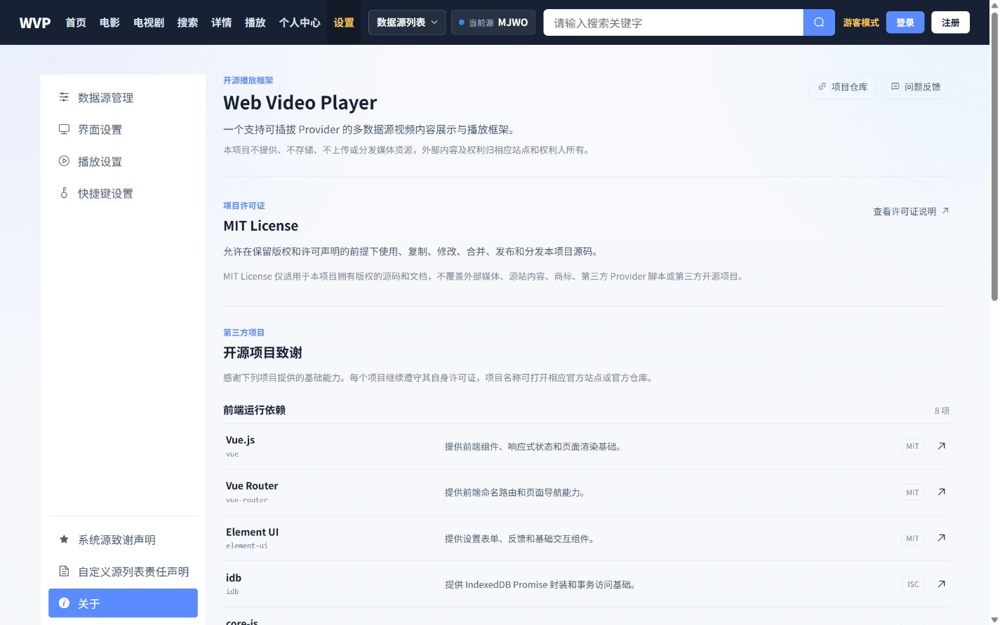

# Web Video Player

[](LICENSE)
[](https://v2.vuejs.org/)
[](https://nodejs.org/)

[在线演示](https://square-john.github.io/web-video-player-v6/) · [公开指南](docs/README.md) · [问题反馈](https://github.com/Square-John/web-video-player-v6/issues)

Web Video Player 是一个由可插拔 Provider 驱动的多数据源影视内容展示与播放框架。它把首页、目录、搜索、详情、播放和个人中心组织成统一体验，同时让不同站点的请求、解析与字段映射留在各自数据源脚本中。

> 本项目不提供、不存储、不上传或分发媒体资源。外部内容、站点和数据源脚本的权利与可用性归相应权利人和提供者；长期使用请支持原站点，并自行准备合法可用的数据源。



## 核心能力

- 首页轮播、热门内容与排行榜，电影和电视剧目录、筛选与分页搜索。
- 标准详情对象、多线路和多分集目录，以及 MP4/HLS 浏览器直连播放。
- 收藏、逐集播放历史、播放进度、上次线路恢复和失效数据源重新搜索。
- 系统源与自定义源管理、授权、启停、更新、健康检测、挑战处理和私有状态隔离。
- IndexedDB 连续无损升级，保留用户收藏、历史、设置和 Provider 私有空间。
- 根配置驱动的本地一键启动、静态前端构建、Node 后端部署和受控 JSONL 日志轮转。
- 响应式桌面、平板和手机布局，以及统一导航、设置和播放快捷键。

## 架构

```text
页面与组件
    ↓ SourceDataRequest / 标准 ContentItem
Service / Store / SourceRuntime
    ↓ 当前 sourceId 的受控能力
Source Shell
    ↓ network / storage / challenge / logger / signal
单文件 Provider
    ↓ 自行构造请求、维护会话、解析原始响应
后端无状态代理
    ↓ 安全、无损地搬运信息请求
外部站点

浏览器播放器 ── 直连 playback.media.url ──> 媒体服务
```

Provider 是源站业务的唯一负责人；公共前端只消费标准对象，Source Shell 只限制能力，后端代理不解析站点业务，也不转发媒体流。完整接入边界见 [前端展示能力与字段契约](docs/前端展示能力与字段契约.md) 和 [数据源脚本开发指南](docs/数据源脚本开发指南.md)。

## 快速开始

需要 Node.js 20 或更高版本、npm 和支持 ES Modules、IndexedDB、MP4/HLS 的现代浏览器。

```bash
npm --prefix client install
npm --prefix server install
npm run dev
```

默认同时启动前端和后端，然后打开 `http://localhost:5173`。`config/project.config.js` 决定启动全部、仅前端、仅后端或手动选择；前后端连接和监听分别由 `config/frontend.config.js`、`config/backend.config.js` 管理。

常用命令：

```bash
npm run dev:frontend
npm run dev:backend
npm run dev:all
npm run build
```

生产前端输出到 `client/dist/`，后端使用 `npm run start:backend` 启动。完整配置和部署方式在 [公开指南](docs/README.md) 中分项维护。

## 数据源

内置源和用户导入源都以单文件 ES Module 交付，并经过同一套静态预检、授权、SourceExecutionHost、SourceContext 和 Repository 流程。新增站点不应修改页面、Store、通用 Service、Runtime、Shell 或后端代理。

- 当前语言无关协议向量：[contracts/current](contracts/current/)
- 契约向量职责与升级规则：[contracts/README.md](contracts/README.md)
- 公开 Provider 开发入口：[数据源脚本开发指南](docs/数据源脚本开发指南.md)

## 文档

- [公开指南](docs/README.md)：安装、页面字段、Provider 开发、部署、兼容和常见问题入口。
- [当前版本与兼容性](docs/当前版本与兼容性.md)：当前版本、Provider、数据库、协议和端口事实。
- [前端展示能力与字段契约](docs/前端展示能力与字段契约.md)：平台标准对象、各页面请求和展示能力。
- [MIT License](LICENSE)：项目源码授权全文。

## 参与项目

- [贡献指南](docs/CONTRIBUTING.md)：开发环境、架构边界、Provider 贡献和提交要求。
- [安全策略](docs/SECURITY.md)：私下报告漏洞、支持范围和部署安全责任。
- [问题反馈](https://github.com/Square-John/web-video-player-v6/issues)：普通缺陷和功能建议；不要公开敏感信息或未修复漏洞细节。

## 许可证与声明

项目源码采用 [MIT License](LICENSE)。第三方依赖按各自许可证授权；外部站点、媒体内容、内置 Provider 和用户导入 Provider 不因接入本项目而并入 MIT 授权。

- [第三方声明](docs/THIRD_PARTY_NOTICES.md)：主要直接运行和生产构建依赖、许可证和项目地址。
- 系统源致谢、源站链接、自定义源责任声明和项目开源依赖可在应用“设置”页面查看。长期使用外部内容服务时，请前往相应源站支持原服务。
